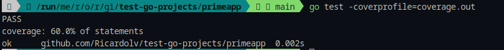
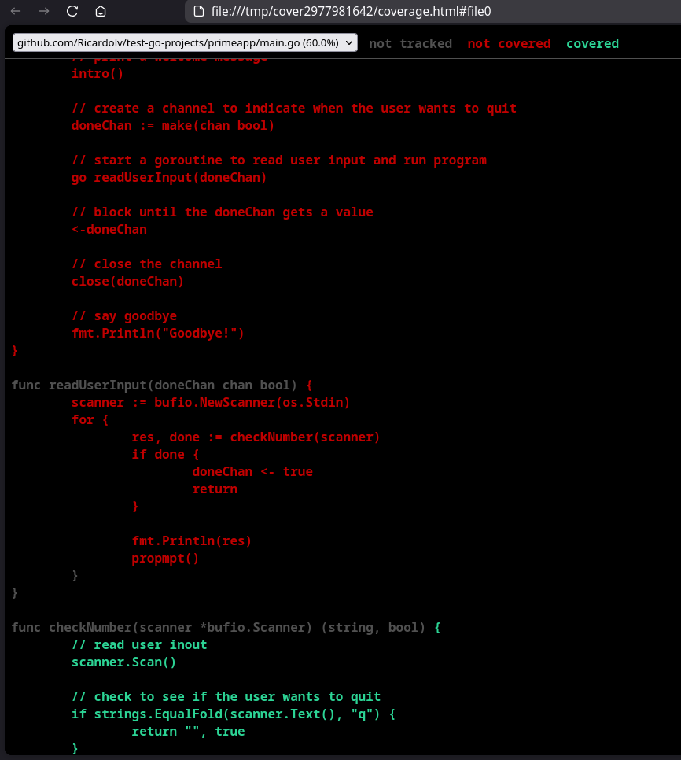

# Testing in go

### Projects:
- primeapp


#### Example, commands:
```console
go test .
```


```console
go test -v .
```


```console
go test -cover .
```


```console
go test -coverprofile=coverage.out
```



```console
go tool cover -html=coverage.out
```


---